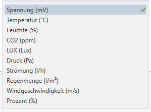

# **Analog-Eingäne**

<!-- DOC HelpContext="Dokumentation" -->

<!-- DOCCONTENT
Eine vollständige Applikationsbeschreibung ist unter folgendem Link verfügbar: https://github.com/openknx/OFM-BinaryInput/blob/v1/doc/Applikationsbeschreibung-Binaereingang.md
DOCCONTENT -->

Mit dem ADCInput Modul kann man Analoge Messwerte einlesen und sie direkt zum passenden Sensor umwandeln lassen. 
<!-- DOCEND -->

## **Allgemein**

Auf dieser Seite sieht man die in der Applikation verwendete Modulversion und die Anzahl der Analog-Eingänge, die der Benutzer verwenden möchte.

### **Kanalauswahl**

Hier kann man jeden einzeln Kanal auswählen und im Beschreibungsfeld auch genauere Information dazu hinterlassen. Das Macht es einfacher später die genaue Funktion des Kanals noch zu verstehen. 

In der Spalte "Funktion" wird der Kanal aktiviert. Es stehen mehrere Auswahlmöglichkeiten bereit. 

#### inaktiv
Damit wird der Kanal deaktiviert. 

#### ADC-Wert (mV)
Hier kann man sich den Analogwert einlesen lassen und dazu sich den Wert auch gleich passend umwandeln lassen. D.h. wenn man einen analogen Temperatursensor anschließt, kann man hier später in den Kanaleinstellungen den passenden Ausgangs DPT wählen und eine Kennlinie des Sensors hinterlegen. 
Damit bekommt man direkt den Temperatur-Wert des Sensor ausgegeben. 

#### SMT50-Feuchte
Wenn ein SMT50 Bodenfeuchte-Sensor verwendet wird, kann man sich die ganzen Einstellungen mit DPT und Kennlinie sparen. Hier muss man sich nur noch um das Senden kümmern und das KO verbinden. 

#### SMT50-Temp
Wenn ein SMT50 Bodenfeuchte-Sensor verwendet wird, kann man sich die ganzen Einstellungen mit DPT und Kennlinie sparen. Hier muss man sich nur noch um das Senden kümmern und das KO verbinden.

## **ADC-Input *x***

Da alle Eingänge gleich aussehen, wird hier nur ein Eingang Beschrieben. In der Applikation wird das *x* durch einen Buchstaben ersetzt, der die Nummer des Analog-Eingangs repräsentiert.

### **Beschreibung**

### Korrekturfaktor
Mit hilfe des Korrekturfaktors können, wenn benötigt, die Toleranzen des Messsystems ausgeglichen werden.

Um die 'vom Device gemessene Spannung' zu bestimmen, muss zuvor der Sensortyp auf 'ADC-Wert(mV)' und die Meßwerteinheit auf 'Spannung (mV)' gestellt werden. Dazu ein passendes KO belegt werden, welches den Wert ausgibt.

Danach kann der Korrekturfaktor bestimmt und eingetragen werden und der Sensortyp und die Meßwerteinheit auf die gewünschte Einheit gestellt werden.

Korrekturfaktor = gemessene Spannung(mV) am Device-Pin / vom Device ausgegebene Spannung(mV)

### Meßwerteinheit (KO)
Hier kann die gewünschte Einheit/DPT ausgewählt werden. Bein manchen Einheiten gibt es weitere Einstellmöglichgkeiten mit denen man die Kennlinie des angeschlossenen Sensors nachbilden kann.  

<kbd></kbd>

Der Sensorwert wird über die Geradengleichung y = m*x + b bestimmt. Ist die Geradengleichung des Sensors nicht bekannt, kann diese über zwei Punkte auf der Kennlinie (x,y) bestimmt werden. 
Hilfe: bei Google nach "Geradengleichung aus 2 punkten rechner" suchen. Anschließend findet man einfach rechner, wo man die zwei Punkte nur noch eingeben muss. 

#### Wert m
Steigung der Gerade

#### Wert b
Offset der Gerade

### Zyklisch senden
Hier kann die Zeit angegeben werden, nach der das letzte gesendete Signal erneut gesendet werden soll. Dieser Vorgang wird ohne Unterbrechung wiederholt.

### senden bei absoluter Abweichung
Hier kann der Wert angegeben werden, bei welcher Wertänderung gesendet werden soll

### senden bei relativer Abweichung
Hier kann der Prozentwert angegeben werden, bei welcher Abweichung gesendet werden soll.

### Wert glätten: P = 
NICHT IMPLEMENTIERT !!!

